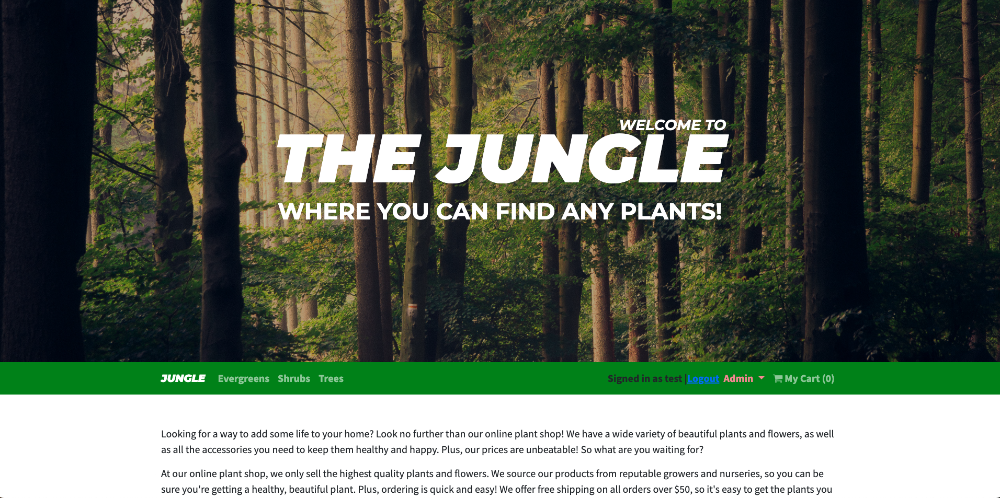
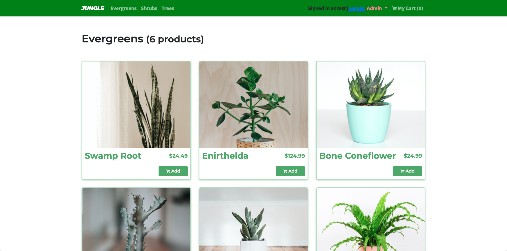
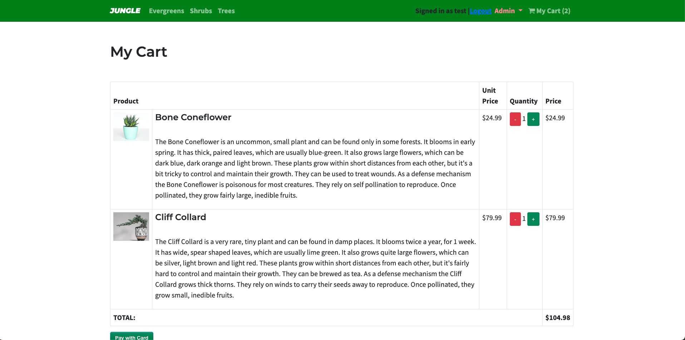
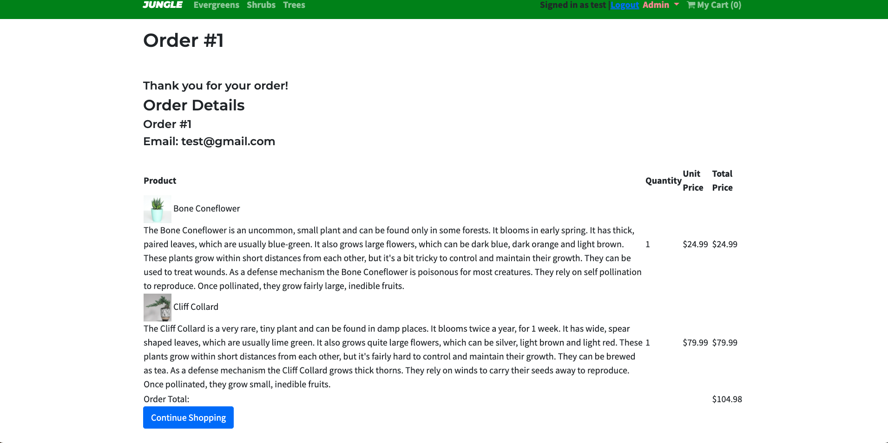
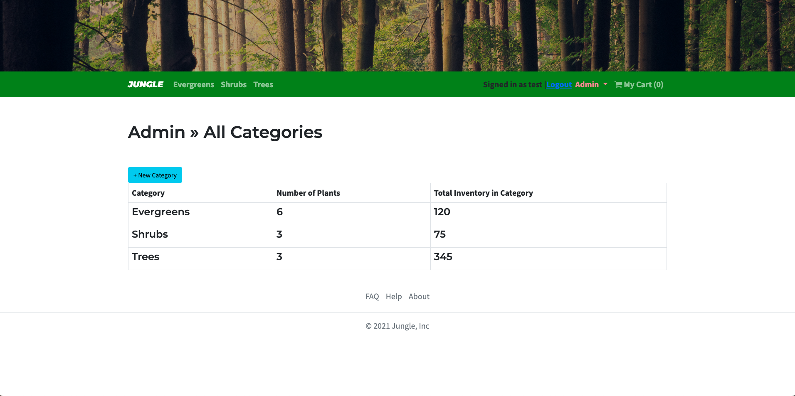
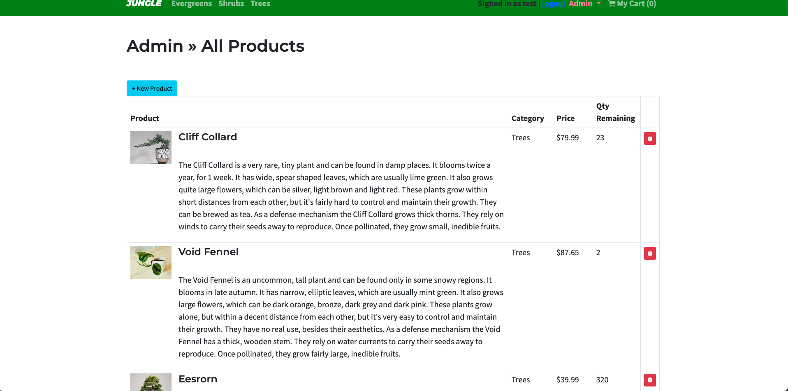

# Jungle

Jungle is a mini e-commerce application build with Rails 6.1.

- Visitors are able to:
  - register their Name, Last Name, Email, and Password
  - navigate the home page
  - click on an item to see a description
  - add items to the cart

Visitors are required to register and log in before purchasing items.

- Users, once registed and logged in, are able to:
  - complete their order and checkout

After checking out and validating the user's payment method, an order is generated, detailing the:

- order number
- user email
- products purchased and their quantities and prices

Under the Admin section, a user is able to:

- create a category
- add products to a category
- delete a product from a category

## Setup

1. Run `bundle install` to install dependencies
2. Create `config/database.yml` by copying `config/database.example.yml`
3. Create `config/secrets.yml` by copying `config/secrets.example.yml`
4. Run `bin/rails db:reset` to create, load and seed db
5. Create .env file based on .env.example
6. Sign up for a Stripe account
7. Put Stripe (test) keys into appropriate .env vars
8. Run `bin/rails s -b 0.0.0.0` to start the server

## Database

If Rails is complaining about authentication to the database, uncomment the user and password fields from `config/database.yml` in the development and test sections, and replace if necessary the user and password `development` to an existing database user.

## Stripe Testing

Use Credit Card # 4111 1111 1111 1111 for testing success scenarios.

More information in their docs: <https://stripe.com/docs/testing#cards>

## Dependencies

- Rails 6.1 [Rails Guide](http://guides.rubyonrails.org/v6.1/)
- Bootstrap 5
- PostgreSQL 9.x
- Stripe
- Cypress
